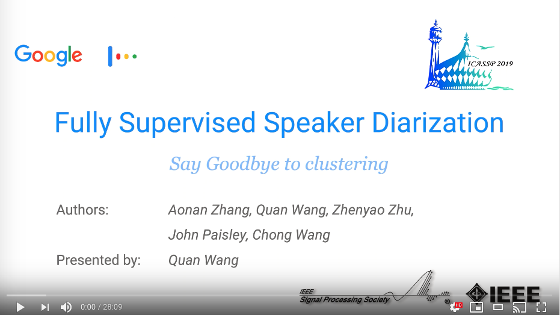

# UIS-RNN
[](https://github.com/google/uis-rnn/actions/workflows/pythonapp.yml) [](https://pypi.python.org/pypi/uisrnn) [](https://pypi.org/project/uisrnn) [](https://pepy.tech/project/uisrnn) [](https://codecov.io/gh/google/uis-rnn) [](https://google.github.io/uis-rnn)

## Overview

This is the library for the
*Unbounded Interleaved-State Recurrent Neural Network (UIS-RNN)* algorithm.
UIS-RNN solves the problem of segmenting and clustering sequential data
by learning from examples.

This algorithm was originally proposed in the paper
[Fully Supervised Speaker Diarization](https://arxiv.org/abs/1810.04719).

The work has been introduced by
[Google AI Blog](https://ai.googleblog.com/2018/11/accurate-online-speaker-diarization.html).


## Disclaimer

This open source implementation is slightly different than the internal one
which we used to produce the results in the
[paper](https://arxiv.org/abs/1810.04719), due to dependencies on
some internal libraries.

We CANNOT share the data, code, or model for the speaker recognition system
([d-vector embeddings](https://google.github.io/speaker-id/publications/GE2E/))
used in the paper, since the speaker recognition system
heavily depends on Google's internal infrastructure and proprietary data.

**This library is NOT an official Google product.**

We welcome community contributions ([guidelines](CONTRIBUTING.md))
to the [`uisrnn/contrib`](uisrnn/contrib) folder.
But we won't be responsible for the correctness of any community contributions.

## Dependencies

This library depends on:

* python 3.5+
* numpy 1.15.1
* pytorch 1.3.0
* scipy 1.1.0 (for evaluation only)

## Getting Started

[](https://www.youtube.com/watch?v=pGkqwRPzx9U)

### Install the package

Without downloading the repository, you can install the
[package](https://pypi.org/project/uisrnn/) by:

```
pip3 install uisrnn
```

or

```
python3 -m pip install uisrnn
```

### Run the demo

To get started, simply run this command:

```bash
python3 demo.py --train_iteration=1000 -l=0.001
```

This will train a UIS-RNN model using `data/toy_training_data.npz`,
then store the model on disk, perform inference on `data/toy_testing_data.npz`,
print the inference results, and save the averaged accuracy in a text file.

PS. The files under `data/` are manually generated *toy data*,
for demonstration purpose only.
These data are very simple, so we are supposed to get 100% accuracy on the
testing data.

### Run the tests

You can also verify the correctness of this library by running:

```bash
bash run_tests.sh
```

If you fork this library and make local changes, be sure to use these tests
as a sanity check.

Besides, these tests are also great examples for learning
the APIs, especially `tests/integration_test.py`.

## Core APIs

### Glossary

| General Machine Learning | Speaker Diarization    |
|--------------------------|------------------------|
| Sequence                 | Utterance              |
| Observation / Feature    | Embedding / d-vector   |
| Label / Cluster ID       | Speaker                |

### Arguments

In your main script, call this function to get the arguments:

```python
model_args, training_args, inference_args = uisrnn.parse_arguments()
```

### Model construction

All algorithms are implemented as the `UISRNN` class. First, construct a
`UISRNN` object by:

```python
model = uisrnn.UISRNN(args)
```

The definitions of the args are described in `uisrnn/arguments.py`.
See `model_parser`.

### Training

Next, train the model by calling the `fit()` function:

```python
model.fit(train_sequences, train_cluster_ids, args)
```

The definitions of the args are described in `uisrnn/arguments.py`.
See `training_parser`.

The `fit()` function accepts two types of input, as described below.

#### Input as list of sequences (recommended)

Here, `train_sequences` is a list of observation sequences.
Each observation sequence is a 2-dim numpy array of type `float`.

* The first dimension is the length of this sequence. And the length
  can vary from one sequence to another.
* The second dimension is the size of each observation. This
  must be consistent among all sequences. For speaker diarization,
  the observation could be the
  [d-vector embeddings](https://google.github.io/speaker-id/publications/GE2E/).

`train_cluster_ids` is also a list, which has the same length as
`train_sequences`. Each element of `train_cluster_ids` is a 1-dim list or
numpy array of strings, containing the ground truth labels for the
corresponding sequence in `train_sequences`.
For speaker diarization, these labels are the speaker identifiers for each
observation.

When calling `fit()` in this way, please be very careful with the argument
`--enforce_cluster_id_uniqueness`.

For example, assume:

```python
train_cluster_ids = [['a', 'b'], ['a', 'c']]
```

If the label `'a'` from the two sequences refers to the same cluster across
the entire dataset, then we should have `enforce_cluster_id_uniqueness=False`;
otherwise, if `'a'` is only a local indicator to distinguish from `'b'` in the
1st sequence, and to distinguish from `'c'` in the 2nd sequence, then we should
have `enforce_cluster_id_uniqueness=True`.

Also, please note that, when calling `fit()` in this way, we are going to
concatenate all sequences and all cluster IDs, and delegate to
the next section below.

#### Input as single concatenated sequence

Here, `train_sequences` should be a single 2-dim numpy array of type `float`,
for the **concatenated** observation sequences.

For example, if you have *M* training utterances,
and each utterance is a sequence of *L* embeddings. Each embedding is
a vector of *D* numbers. Then the shape of `train_sequences` is *N * D*,
where *N = M * L*.

`train_cluster_ids` is a 1-dim list or numpy array of strings, of length *N*.
It is the **concatenated** ground truth labels of all training data.

Since we are concatenating observation sequences, it is important to note that,
ground truth labels in `train_cluster_id` across different sequences are
supposed to be **globally unique**.

For example, if the set of labels in the first
sequence is `{'A', 'B', 'C'}`, and the set of labels in the second sequence
is `{'B', 'C', 'D'}`. Then before concatenation, we should rename them to
something like `{'1_A', '1_B', '1_C'}` and `{'2_B', '2_C', '2_D'}`,
unless `'B'` and `'C'` in the two sequences are meaningfully identical
(in speaker diarization, this means they are the same speakers across
utterances). This part will be automatically taken care of by the argument
`--enforce_cluster_id_uniqueness` for the previous section.

The reason we concatenate all training sequences is that, we will be resampling
and *block-wise* shuffling the training data as a **data augmentation**
process, such that we result in a robust model even when there is insufficient
number of training sequences.

#### Training on large datasets

For large datasets, the data usually could not be loaded into memory at once.
In such cases, the `fit()` function needs to be called multiple times.

Here we provide a few guidelines as our suggestions:

1. Do not feed different datasets into different calls of `fit()`. Instead,
   for each call of `fit()`, the input should cover sequences from
   different datasets.
2. For each call to the `fit()` function, make the size of input roughly the
   same. And, don't make the input size too small.

### Prediction

Once we are done with training, we can run the trained model to perform
inference on new sequences by calling the `predict()` function:

```python
predicted_cluster_ids = model.predict(test_sequences, args)
```

Here `test_sequences` should be a list of 2-dim numpy arrays of type `float`,
corresponding to the observation sequences for testing.

The returned `predicted_cluster_ids` is a list of the same size as
`test_sequences`. Each element of `predicted_cluster_ids` is a list of integers,
with the same length as the corresponding test sequence.

You can also use a single test sequence for `test_sequences`. Then the returned
`predicted_cluster_ids` will also be a single list of integers.

The definitions of the args are described in `uisrnn/arguments.py`.
See `inference_parser`.

## Citations

Our paper is cited as:

```
@inproceedings{zhang2019fully,
  title={Fully supervised speaker diarization},
  author={Zhang, Aonan and Wang, Quan and Zhu, Zhenyao and Paisley, John and Wang, Chong},
  booktitle={International Conference on Acoustics, Speech and Signal Processing (ICASSP)},
  pages={6301--6305},
  year={2019},
  organization={IEEE}
}
```

## References

### Baseline diarization system

To learn more about our baseline diarization system based on
*unsupervised clustering* algorithms, check out
[this site](https://google.github.io/speaker-id/publications/LstmDiarization/).

A Python re-implementation of the *spectral clustering* algorithm used in this
paper is available [here](https://github.com/wq2012/SpectralCluster).

The ground truth labels for the
[NIST SRE 2000](https://catalog.ldc.upenn.edu/LDC2001S97)
dataset (Disk6 and Disk8) can be found
[here](https://github.com/google/speaker-id/tree/master/publications/LstmDiarization/evaluation/NIST_SRE2000).

For more public resources on speaker diarization, check out [awesome-diarization](https://github.com/wq2012/awesome-diarization).

### Speaker recognizer/encoder

To learn more about our speaker embedding system, check out
[this site](https://google.github.io/speaker-id/publications/GE2E/).

We are aware of several third-party implementations of this work:

* [Resemblyzer: PyTorch implementation by resemble-ai](https://github.com/resemble-ai/Resemblyzer)
* [TensorFlow implementation by Janghyun1230](https://github.com/Janghyun1230/Speaker_Verification)
* [PyTorch implementaion by HarryVolek](https://github.com/HarryVolek/PyTorch_Speaker_Verification) - with UIS-RNN integration
* [PyTorch implementation as part of SV2TTS](https://github.com/CorentinJ/Real-Time-Voice-Cloning)

Please use your own judgement to decide whether you want to use these
implementations.

**We are NOT responsible for the correctness of any third-party implementations.**

## Variants

Here we list the repositories that are based on UIS-RNN, but integrated with
other technologies or added some improvements.

| Link | Description |
| ---- | ----------- |
| [taylorlu/Speaker-Diarization](https://github.com/taylorlu/Speaker-Diarization)  | Speaker diarization using UIS-RNN and GhostVLAD. An easier way to support openset speakers. |
| [DonkeyShot21/uis-rnn-sml](https://github.com/DonkeyShot21/uis-rnn-sml)  | A variant of UIS-RNN, for the paper Supervised Online Diarization with Sample Mean Loss for Multi-Domain Data. |
